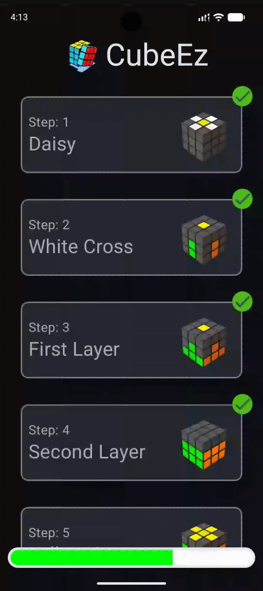
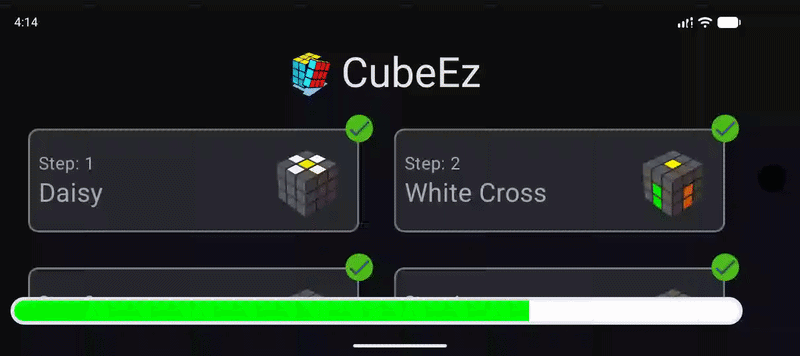
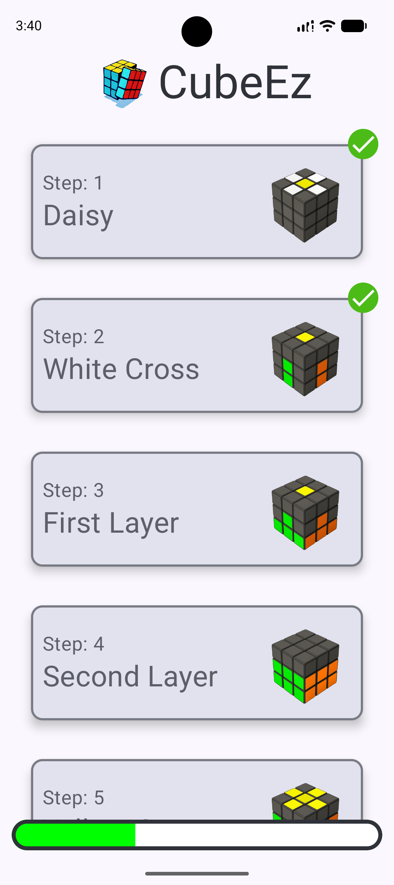
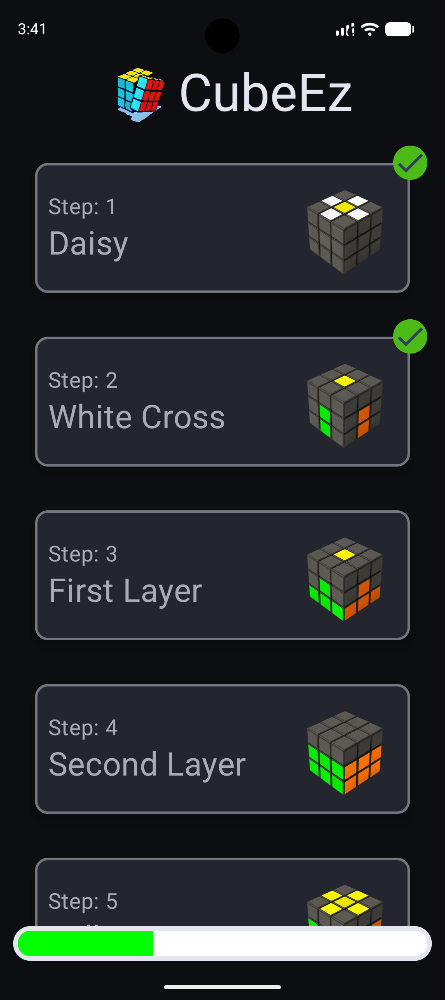
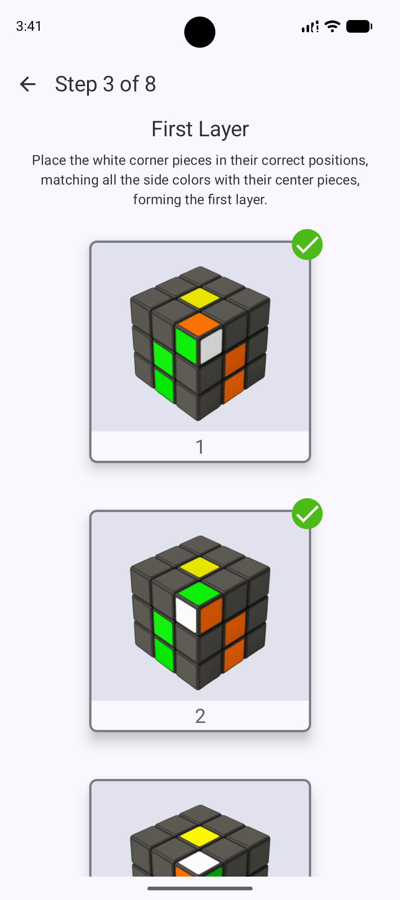
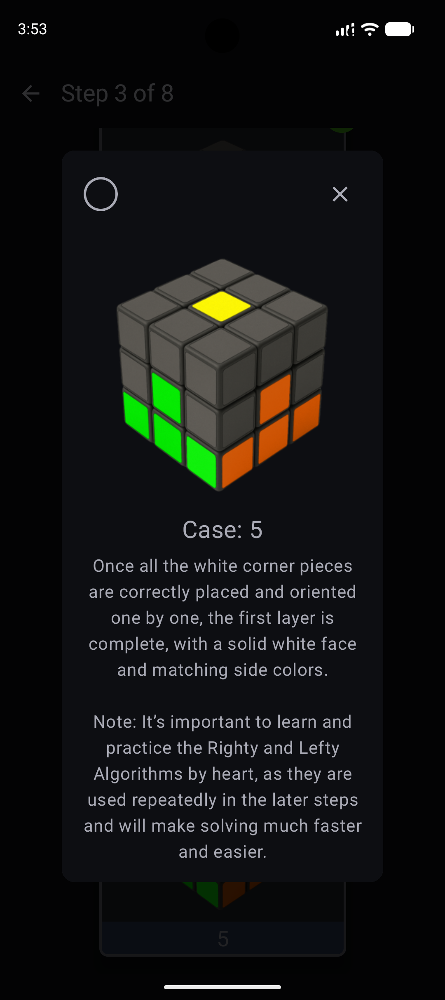

# CubeEz for Android 🧩

A modern Rubik's Cube learning app built with **Jetpack Compose** and clean **MVVM architecture**. Learn to solve a Rubik's Cube through a structured 8-step beginner method with interactive cases, algorithm explanations, and persistent progress tracking.

## 🎬 Demo

<table>
  <tr>
    <th>Portrait</th>
    <th>Landscape</th>
  </tr>
  <tr>
    <td></td>
    <td></td>
  </tr>
</table>

## 📸 Screenshots

| Home Screen (Light) | Home Screen (Dark) |
|---------------------|--------------------|
|  |  |

| Step Screen (Light) | Case Dialog (Dark) |
|---------------------|--------------------|
|  |  |

## ✨ Features

- **8-Step Learning System:** Learn the beginner method from Daisy to Yellow Corner Orientation.
- **23 Interactive Cases:** Step-by-step cases with algorithms and explanations.
- **Progress Tracking:** Mark completed cases and track your overall learning progress across app launches.
- **Expandable Case Cards:** View algorithms and explanations only when needed.
- **Adaptive UI:** Home screen grid, lesson navigation, and case dialogs automatically adjust for portrait and landscape layouts.
- **Persistent Storage:** Progress is saved locally using **Room Database**.
- **Dynamic Content:** Lesson content is loaded from a GitHub-hosted JSON source using **Retrofit**.
- **Image Loading:** Case images are displayed efficiently using **Coil**.

## 🎯 Why I Built This

I created CubeEz to practice modern Android development with Jetpack Compose, MVVM architecture, Room, Retrofit, and adaptive layouts while building a useful learning tool for Rubik's Cube beginners.

## 🛠 Tech Stack & Architecture

### Tech Stack

- **Language:** Kotlin
- **UI:** Jetpack Compose
- **Architecture:** MVVM (Model–View–ViewModel)
- **Navigation:** Navigation Compose
- **Networking:** Retrofit
- **Database:** Room Database
- **Image Loading:** Coil

### Architecture

```text
UI (Jetpack Compose)
        │
        ▼
    ViewModel
        │
        ▼
    Repository
     ↙      ↘
  Room    Retrofit
```

## 🚀 Build & Run

### Prerequisites

- Android Studio (latest stable version)
- JDK 17 or higher

### Installation

1. Clone the repository:

```sh
git clone https://github.com/Gaurav12480/CubeEz.git
```

2. Open the project in Android Studio.

3. Let Gradle sync all dependencies.

4. Select an emulator or physical Android device.

5. Click **Run**.

## 📄 License

This project is licensed under the **MIT License**. See the [LICENSE](LICENSE) file for details.